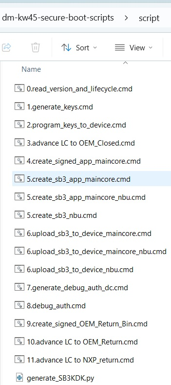
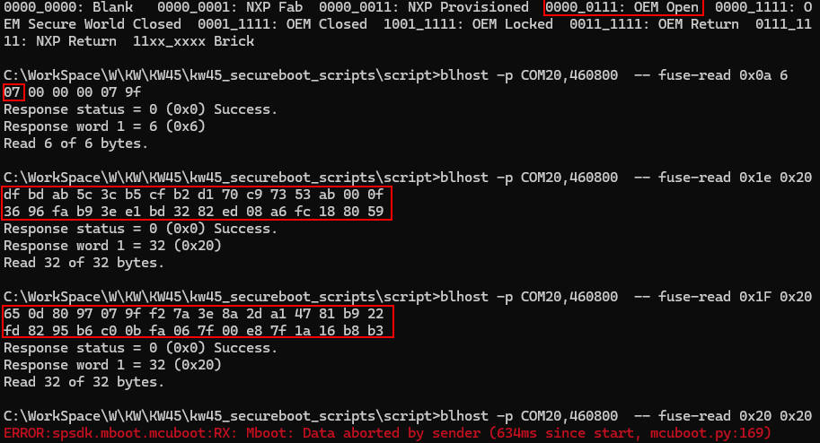
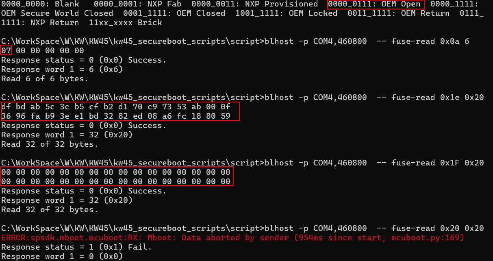
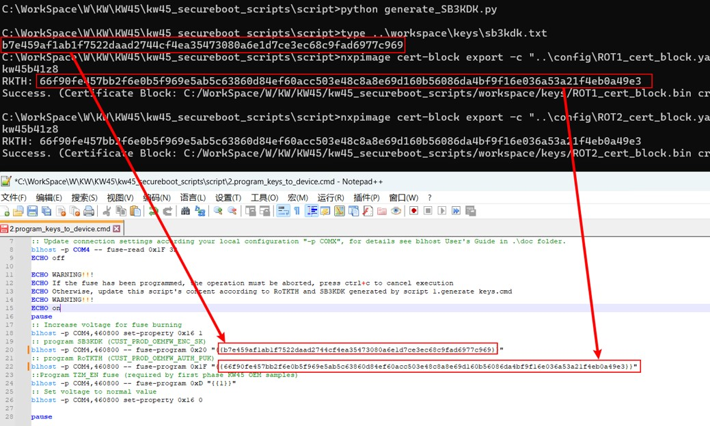
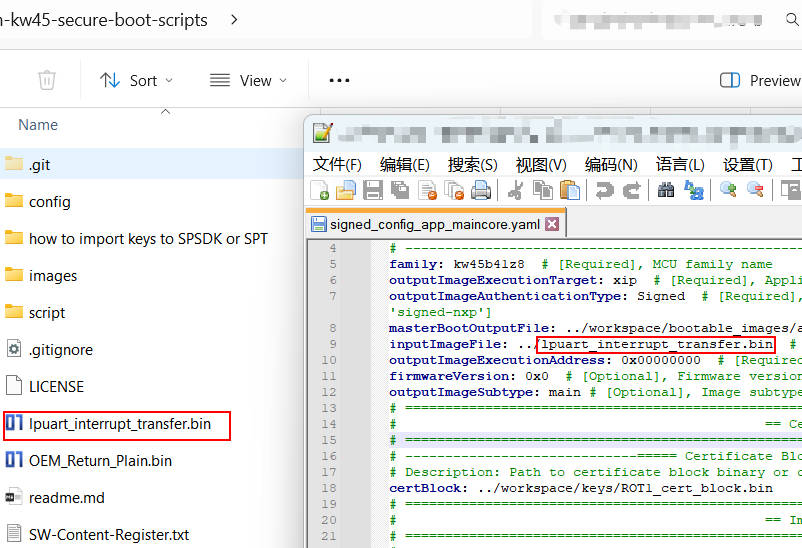
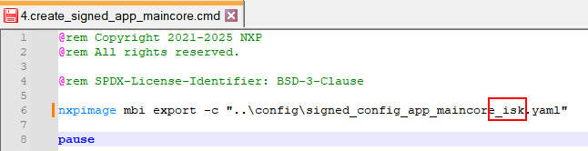
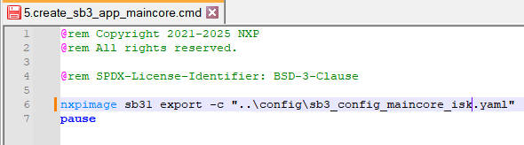

# NXP Application Code Hub
[](https://www.nxp.com)

## KW45: Secure boot scripts based on spsdk
This is Secure Provisioning SDK (spsdk) scripts package is used for KW45 secure boot, including generating keys, programming fuse, signing image, generating sb3 file, debugging authentication and advancing lifecycle.<br /><a href="https://spsdk.readthedocs.io/en/latest/">https://spsdk.readthedocs.io/</a>


#### Boards: KW45B41Z-EVK, KW45B41Z-LOC, FRDM-MCXW71, MCX-W71-EVK
#### Categories: Wireless Connectivity, Secure Provisioning, Tools, Security
#### Peripherals: UART, Bluetooth
#### Toolchains: MCUXpresso IDE


## Table of Contents
1. [Software](#step1)
2. [Hardware](#step2)
3. [Setup](#step3)
4. [Results](#step4)
5. [FAQs](#step5) 
6. [Support](#step6)
7. [Release Notes](#step7)

## 1. Software<a name="step1"></a>
python: 3.9+

spsdk: 2.6.0

J-Link Commander: 8.10+

## 2. Hardware<a name="step2"></a>
KW45B41Z-EVK / Custom board

*If the custom board is tested:*

J-Link

USB-serial adapter

## 3. Setup<a name="step3"></a>
If you are using KW45B41Z-EVK, it's easy, just connect the USB port(J14) of EVK to the computer.

[Getting Started with the KW45B41Z Evaluation Kit](https://www.nxp.com/document/guide/getting-started-with-the-kw45b41z-evaluation-kit:GS-KW45B41ZEVK)

If you are using your own custom board, connect KW45 UART1 to USB-UART adapter, for some scripts, J-Link is needed.

To enter ISP mode, KW45's PTA4 pin (BOOT_CONFIG) needs to be in logic high during reset.

If KW45B41Z-EVK is used, press the button SW4(PTA4) when reset, KW45 will enter ISP mode. 

Install spsdk
```
python -m pip install --upgrade pip
pip install spsdk
spsdk –version
```
Enter the directory "script" and double-click the script to run.



## 4. Results<a name="step4"></a>

### 4.1 Step 1
check the lifecycle and keys
```
enter ISP mode
0.read_version_and_lifecycle.cmd
```
The default lifecycle should be 7 (OEM_Open).

KW45's fuses on EVK have been programmed when production and the fuse is one time programming, it is not allowed to be programmed again.

KW45 on KW45B41Z-EVK default keys:



KW45 factory default keys:




### 4.2 Step 2
generate keys and put sb3kdk & RoTHTH to script "2.program_keys_to_device.cmd"
```
1.generate_keys.cmd
```


If KW45B41Z-EVK is used, this step is not needed, please copy the evk default keys from ".\how to import keys to SPSDK or SPT\kw45evk_keys" to ".\workspace\keys"
### 4.3 Step 3
program keys to device

***WARNING!!!*** 

Script performs destructive operation (programs fuses), make sure script is updated with valid data. And note that the fuses are one time programming.
```
2.program_keys_to_device.cmd
```


### 4.4 Step 4
advance lifecycle to OEM_Closed
```
3.advance LC to OEM_Closed.cmd
```
### 4.5 Step 5
sign main core image

Copy the image of main core to the root directory, then change inputImageFile in the configuration file.
```
4.create_signed_app_maincore.cmd
```


### 4.6 Step 6
generate sb3 file for maincore and/or NBU
```
5.create_sb3_app_maincore.cmd
OR generate sb3 file for NBU
OR 5.create_sb3_app_maincore_nbu.cmd
```
If the NBU is involved, copy the signed image of NBU (*.xip) from "SDK\middleware\wireless\ble_controller\bin" to the root directory.


### 4.7 Step 7
upload the firmware of maincore and/or NBU to device
```
6.upload_sb3_to_device_maincore.cmd
OR 6.upload_sb3_to_device_maincore_nbu.cmd
OR 6.upload_sb3_to_device_nbu.cmd
```
### 4.8 Step 8
debug authentication

Note: J-Link is needed
```
7.generate_debug_auth_dc.cmd
8.debug_auth.cmd
```
If successful then J-Link commander can be used to debug KW45.

Note some IDE may reset KW45, KW45 will lose authentication status.

The recommended IDE is Ozone.
### 4.9 Step 9
advance lifecycle to OEM_Return

Note: debuging auth is needed
```
9.create_signed_OEM_Return_Bin.cmd
10.advance LC to OEM_Return.cmd
```


## 5. FAQs<a name="step5"></a>
1. Failure to read fuse 0x20 is expected because this fuse is unreadable

    
2. How to use ISK?

    

    
3. At the Lifecycle OME_Open and OEM_Return, the firmware of main core can be written directly by writing Flash, but the firmware of NBU can only be uploaded via SB3 at any time.

4. The known issue: due to spsdk, advancing lifecycle to OEM_Retrun is not currently supported


## 6. Support<a name="step6"></a>
[nxp.com](https://www.nxp.com/products/KW45)

rm885660-KW45 Security Reference Manual(6.0).pdf

AN13838 Secure Boot for KW45 and K32W

AN13883 Updating KW45 Radio Firmware via ISP using SPSDK

AN13931 Managing Lifecycles on KW45 and K32W148

AN14109 KW45 and K32W148 Secure Boot Using the SEC Tool

AN14158Debug Authentication on KW45/K32W148

AN14003 Programming the KW45 flash for Application and Radio firmware via Serial
Wire Debug during mass production

AN13859 KW45B41Z and K32W148 In-System Programming Utility


#### Project Metadata

<!----- Boards ----->
[]()
[]()
[]()
[]()

<!----- Categories ----->
[](https://mcuxpresso.nxp.com/appcodehub?category=wireless_connectivity)
[](https://mcuxpresso.nxp.com/appcodehub?category=sec_provi)
[](https://mcuxpresso.nxp.com/appcodehub?category=tools)
[](https://mcuxpresso.nxp.com/appcodehub?category=security)

<!----- Peripherals ----->
[](https://mcuxpresso.nxp.com/appcodehub?peripheral=uart)
[](https://mcuxpresso.nxp.com/appcodehub?peripheral=bluetooth)

<!----- Toolchains ----->
[](https://mcuxpresso.nxp.com/appcodehub?toolchain=mcux)

Questions regarding the content/correctness of this example can be entered as Issues within this GitHub repository.

>**Warning**: For more general technical questions regarding NXP Microcontrollers and the difference in expected functionality, enter your questions on the [NXP Community Forum](https://community.nxp.com/)

[](https://www.youtube.com/NXP_Semiconductors)
[](https://www.linkedin.com/company/nxp-semiconductors)
[](https://www.facebook.com/nxpsemi/)
[](https://x.com/NXP)

## 7. Release Notes<a name="step7"></a>
| Version | Description / Update                           | Date                        |
|:-------:|------------------------------------------------|----------------------------:|
| 1.0     | Initial release on Application Code Hub        | February 19<sup>th</sup> 2025 |

## Licensing
[BSD-3-Clause](./LICENSE)

